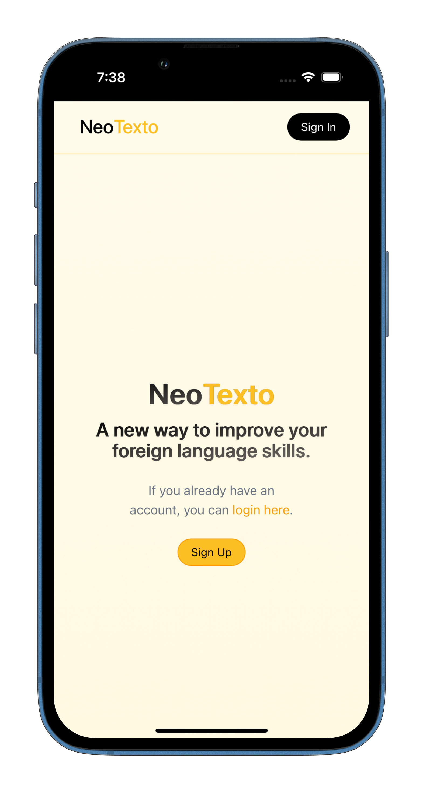

<center>

</center>

# Introduction

NeoTexto is a platform to improve yourself in languages. You can use it to read texts and easily access translations for words you don't know. Import your texts using copy-paste, or using text detection from an image, or simply by asking ChatGPT to generate a text about a subject you are interested in. Save the words you don't know and practice them in games.

<center>


</center>

# Installation

Make sure you have docker and docker-compose.

- Create .env files in backend/ and frontend/ folders and fill them using the respective .env.template files.
- Uncomment languages you want to work with in backend/Dockerfile (English and French will be used by default).

### In development mode

```
docker-compose up --build -d
```

### In production

```
docker-compose -f docker-compose.prod.yml up --build -d
```

In case Docker has permission troubles:

```
sudo chown -R $(id -u):$(id -g) $HOME/.docker
```

# Google

## Authentication

If you wish to connect using Google, you will need to create a new project on Google Cloud Console. Set your app name and user support email in the OAuth Consent Screen. Once you have you credentials and set the right urls, you will need to add a socialaccountprovider in Django's admin:

- Connect to backend container:

```
docker exec -it backend bash
```

- Create a django superuser account:

```
python manage.py createsuperuser
```

- Add a Social Application in Django's admin (use the superuser credentials you just created to authenticate) at http://localhost:8000/back/admin/socialaccount/socialapp/add/ using the secrets and urls you have in your Google Cloud Console.

## Image-To-Text

- To be able to detect text from images, you will need to activate the Google Cloud Vision API.
- Add your service-account-file.json in backend/.
